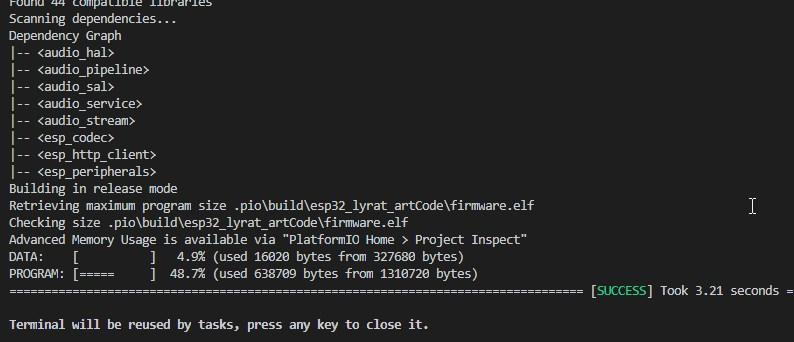
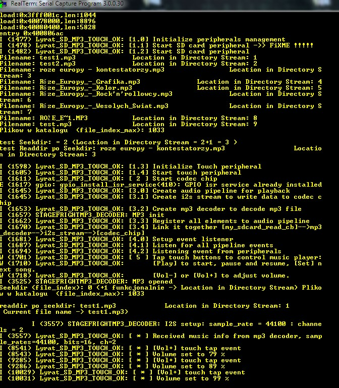

# PlatformIO ESP-ADF next example
# PlatformIO + VScode + Arduino ESP-ADF example - board ESP32 lyraT v4.3 /ESP32-WROVER/
# player mp3 + touch buttons + auto SD card reading with lib dirent.h 

## Description

See https://community.platformio.org/t/esp32-adf-audio-dev-framework-please-help/

## Building

Look into the `platformio.ini` to understand how building works and what you have to change.

## License 

All of the ESP-ADF code is a momentary snapshot of the repo (https://github.com/espressif/esp-adf/) on the
23.11.2018.

All ESP-ADF code is property of Espressif.

# Play MP3 files from microSD with touch pad control 

The demo plays MP3 files stored on the SD card using audio pipeline API.

The playback control is done using ESP32 touch pad functionality. User can start, stop, pause, resume playback and advance to the next song as well as adjust volume. When playing, the application automatically advances to the next song once previous finishes.

To run this example you need ESP32 LyraT or compatible board:

- Connect speakers or headphones to the board. 
- Insert a microSD card loaded with a MP3 files into board's slot.

# Screenshot

